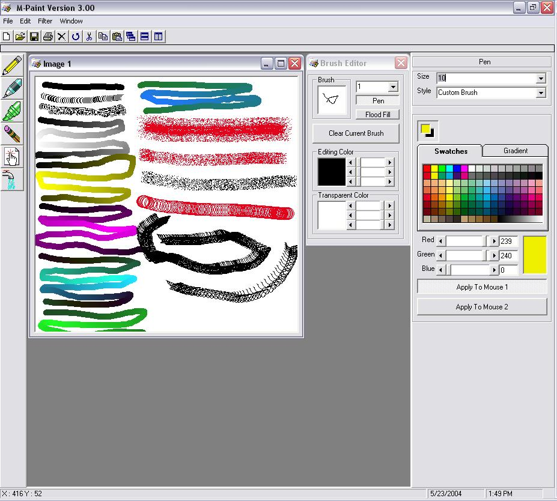



## \[M\-Paint 3\.00\]

### Description

This is the newest version of M-Paint, it has a whole bunch of brushes (solid,stripe,invert,custom,step rgb,step rg,step rb,step gb,step r,step g, step b, step gradient, air bursh, invert air brush, spray paint, and circle) it also has 41 filters for image processing (to see a bunch of the effects look at the screen shot for version 2.00) it has flood fill, window setup, open files, save files, amd much more!

enjoi!

LCSBSSRHXXX

And plz vote!
 
### More Info
 

             |
---                |---
**Submitted On**   |2005-02-28 23:37:08
**By**             |[LCSBSSRHXXX](https://github.com/Planet-Source-Code/PSCIndex/blob/master/ByAuthor/lcsbssrhxxx.md)
**Level**          |Advanced
**User Rating**    |4.8 (110 globes from 23 users)
**Compatibility**  |VB 6\.0
**Category**       |[Graphics](https://github.com/Planet-Source-Code/PSCIndex/blob/master/ByCategory/graphics__1-46.md)
**World**          |[Visual Basic](https://github.com/Planet-Source-Code/PSCIndex/blob/master/ByWorld/visual-basic.md)
**Archive File**   |[\[M\-Paint\_3185906312005\.zip](https://github.com/Planet-Source-Code/lcsbssrhxxx-m-paint-3-00__1-53973/archive/master.zip)

